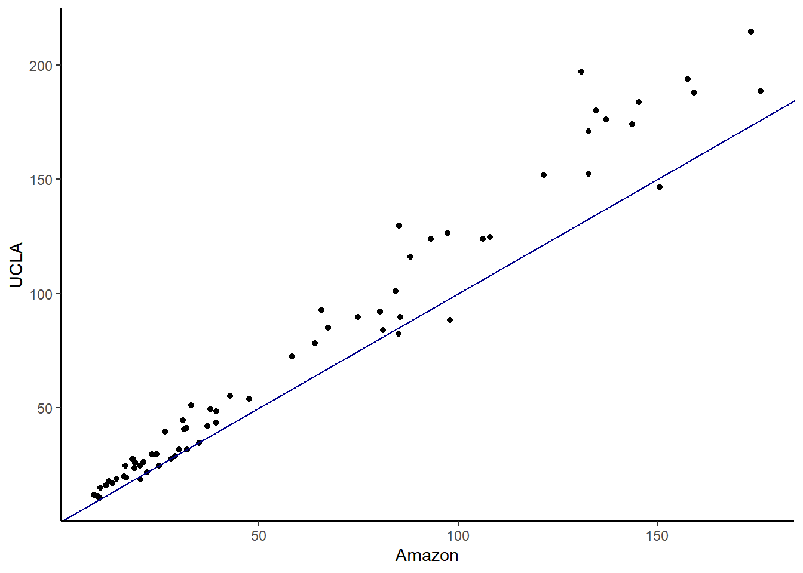

# Additional Hypothesis Tests {#ADDTESTS}

## Objectives

1) Conduct and interpret a goodness of fit test using both Pearson's chi-squared and randomization to evaluate the independence between two categorical variables.  

2) Explain how the chi-squared distribution relates to the normal distribution, where it is used, and how changing parameters impacts the shape of the distribution.   

3) Conduct and interpret a hypothesis test for equality of two means and equality of two variances using both permutation and the CLT.   
 
4) Conduct and interpret a hypothesis test for paired data.
 
5) Know and check the assumptions for Pearson's chi-square and two-sample $t$ tests.  


## Homework  

### Problem 1  

**Golf balls**. Repeat the analysis of the golf ball problem from earlier in the book. This time, we'll compare the observed proportions to a distribution, sometimes called a chi-squared goodness-of-fit test.  


a. Load the data and tally the data into a table. The data is in `golf_balls.csv`.  


```r
golf_balls <- read_csv("data/golf_balls.csv")
```


```r
head(golf_balls)
```

```
## # A tibble: 6 x 1
##   number
##    <dbl>
## 1      3
## 2      2
## 3      1
## 4      4
## 5      4
## 6      3
```


```r
tally(~number, data = golf_balls)
```

```
## number
##   1   2   3   4 
## 137 138 107 104
```


b. Using the function `chisq.test` conduct a hypothesis test of equally likely distribution of balls. You may have to read the help menu. 

The hypotheses from Chapter \@ref(HYPTESTDIST) are 

$H_0$: All of the numbers are equally likely. $\pi_1 = \pi_2 = \pi_3 = \pi_4$ or $\pi_1 = \frac{1}{4}, \pi_2 = \frac{1}{4}, \pi_3 = \frac{1}{4} = \pi_4 = \frac{1}{4}$ 

$H_A$: There is some other distributio of the numbers in the population. At least one population proportion is not $\frac{1}{4}$. 

We use the `chisq.test()` function in `R` to conduct the hypothesis test. 


```r
chisq.test(tally(~number, data = golf_balls), 
           p = c(0.25, 0.25, 0.25, 0.25))
```

```
## 
## 	Chi-squared test for given probabilities
## 
## data:  tally(~number, data = golf_balls)
## X-squared = 8.4691, df = 3, p-value = 0.03725
```

The p-value is 0.03725. We reject the null hypothesis; there is evidence that there is some other distribution of the numbers in the population (at least one population proportion is different from $\frac{1}{4}$). 

c. Repeat part b), but assume balls with the numbers 1 and 2 occur 30\% of the time and balls with 3 and 4 occur 20\%. 


```r
chisq.test(tally(~number, data = golf_balls),
           p = c(0.3, 0.3, 0.2, 0.2))
```

```
## 
## 	Chi-squared test for given probabilities
## 
## data:  tally(~number, data = golf_balls)
## X-squared = 2.4122, df = 3, p-value = 0.4914
```

The p-value is 0.4914. We fail to reject the null hypothesis; there is not enough evidence to say that the distribution of numbers in the population is different from 0.3, 0.3, 0.2 and 0.2.


d. Repeat part c), but use a randomization test this time. You should use $\chi^2$, the chi-squared test statistic, as your test statistic.  

Let's calculate the observed value of the test statistic. 


```r
obs <- chisq(~number, data = golf_balls)
obs
```

```
## X.squared 
##  8.469136
```


Next, we will use a randomization process to find the sampling distribution of our test statistic. Because there is only a single variable, we can't use the `shuffle()` function. Instead, think about what we want to do.  

Under the null hypothesis, all of the numbers (1 through 4) are equally likely. We will generate a sample of the numbers 1 through 4 that is the same size as our `golf_balls` data set (486 observations). Then, we'll use the `chisq()` function to find the chi-square test statistic based on that sample. 


```r
set.seed(1018)
chisq(~sample(1:4, size = 486, replace = TRUE))
```

```
## X.squared 
##  4.584362
```

This assumes that the probability of each number is the same ($\frac{1}{4} for each number). You can also change the probability of each number within your `sample()`. 

Now, let's do the same thing many times. 


```r
set.seed(1018)
results <- do(1000)*chisq(~sample(1:4, size = 486, replace = TRUE))
```


We plot the sampling distribution and compare our observed test statistic (shown as a red line). The chi-square distribution with 3 degrees of freedom 
(4 categories/golf ball numbers minus 1) is shown as a dark blue curve. 


```r
results %>%
  gf_dhistogram(~X.squared, fill = "cyan", color = "black") %>%
  gf_vline(xintercept = obs, color = "red") %>%
  gf_theme(theme_classic()) %>%
  gf_dist("chisq", df = 3, color = "darkblue") %>%
  gf_labs(title = "Sampling distribution of chi-squared test statistic",
          subtitle = "For the distribution of golf ball numbers",
          x = "Test statistic")
```


We find the p-value using `prop1()`. 


```r
prop1(~X.squared >= obs, data = results)
```

```
##  prop_TRUE 
## 0.03196803
```

Based on this p-value, we reject the null hypothesis; there is evidence that at least one population proportion is different from $\frac{1}{4}$. 


### Problem 2 

**Test of variance**. We have not performed a test of variance so we will create our own. Use the `mlb_obp_subset` data set, with only the `IF` and `OF` positions, to conduct a test of equality of two variances. The hypotheses are: 

$H_0:\ \sigma^2_{IF} = \sigma^2_{OF}$. There is no difference in the variance of on-base percentage for infielders and outfielders.  

$H_A:\ \sigma^2_{IF} \neq \sigma^2_{OF}$. There is a difference in variances.  

Use the difference in sample standard deviations as your test statistic. Using a randomization test, find the $p$-value and discuss your decision. Make sure to include all steps of a hypothesis test.  


a. Using the MLB from the lesson, subset on `IF` and `OF`.  


```r
mlb_obp <- read_csv("data/mlb_obp.csv")
```


```r
mlb_prob3 <- mlb_obp %>%
  filter(position=="IF"|position=="OF") %>%
  droplevels()
```


```r
summary(mlb_prob3)
```

```
##    position              obp        
##  Length:274         Min.   :0.1740  
##  Class :character   1st Qu.:0.3100  
##  Mode  :character   Median :0.3310  
##                     Mean   :0.3327  
##                     3rd Qu.:0.3530  
##                     Max.   :0.4370
```

The function `droplevels()` gets rid of `C` and `DH` in the factor levels.

b. Create a side-by-side boxplot.


```r
mlb_prob3 %>%
  gf_boxplot(obp~position) %>%
  gf_theme(theme_classic())
```


The hypotheses are:  
$H_0$: $\sigma^2_{IF}=\sigma^2{OF}$. There is no difference in the variance of on base percentage for infielders and outfielders.  
$H_A$: $\sigma^2_{IF}\neq \sigma^2_{OF}$. There is a difference in variances.
 
c. Use the differences in sample standard deviations as your test statistic. Using a permutation test, find the $p$-value and discuss your decision.  


```r
mlb_prob3 %>%
  group_by(position) %>%
  summarize(stat=sd(obp))
```

```
## # A tibble: 2 x 2
##   position   stat
##   <chr>     <dbl>
## 1 IF       0.0371
## 2 OF       0.0294
```


```r
obs <- mlb_prob3 %>%
  summarize(stat=sd(obp[position=="IF"])-sd(obp[position=="OF"])) %>%
  pull()
obs
```

```
## [1] 0.007651101
```

Let's write a function to shuffle the position.


```r
perm_stat <- function(x){
  x %>% 
  mutate(position=shuffle(position)) %>%
  summarize(stat=sd(obp[position=="IF"])-sd(obp[position=="OF"])) %>%
  pull()
}
```


```r
set.seed(443)
results<-do(1000)*perm_stat(mlb_prob3)
```


```r
results %>% 
  gf_histogram(~perm_stat,fill="cyan",color="black") %>%
  gf_vline(xintercept=obs,color="red") %>%
  gf_theme(theme_classic()) %>%
  gf_labs(title="Sampling distribution of difference in variances",
          subtitle="Randomization permutation test",
          x="Test statistic")
```


The $p$-value is


```r
2*prop1(~(perm_stat>=obs),data=results)
```

```
##  prop_TRUE 
## 0.04395604
```

This is a two sided test since we did not know in advance which variance would be larger. We reject the hypothesis of equal variance but the $p$-value is too close to the significance level. The conclusion is suspect. We need more data.


### Problem 3

Exploration of the chi-squared and $t$ distributions. 

a. In `R`, plot the pdf of a random variable with the chi-squared distribution with 1 degree of freedom. On the same plot, include the pdfs with degrees of freedom of 5, 10 and 50. Describe how the behavior of the pdf changes with increasing degrees of freedom. 


```r
gf_dist("chisq",df=1,col=1) %>%
   gf_dist("chisq",df=5,col=2) %>%
   gf_dist("chisq",df=10,col=3) %>%
   gf_dist("chisq",df=50,col=4) %>%
   gf_lims(y=c(0, 0.25)) %>%
   gf_labs(y="f(x)") %>%
   gf_theme(theme_classic()) 
```


The "bump" moves to the rights as the degrees of freedom increase.

The plot should have a legend, but I could not find a way to do it within `ggformula` so here it is in `ggplot`.


```r
ggplot(data = data.frame(x = c(0, 75)), aes(x)) +
  stat_function(fun = dchisq, n = 101, 
                args = list(df = 1),
                mapping=aes(col="myline1")) + 
  stat_function(fun = dchisq, n = 101, 
                args = list(df = 5),
                mapping=aes(col="myline2")) + 
  stat_function(fun = dchisq, n = 101, 
                args = list(df = 10),
                mapping=aes(col="myline3")) +    
   stat_function(fun = dchisq, n = 101, 
                args = list(df = 50),
                mapping=aes(col="myline4")) + 
   ylab("") +
  scale_y_continuous(breaks = NULL) +
   theme_classic()+
scale_colour_manual(name="Legend",
    values=c(myline1="black", 
             myline2="red",
             myline3="green",
             myline4="blue"),
    labels=c("df=1","df=5","df=10","df=50"))
```


b. Repeat part (a) with the $t$ distribution. Add the pdf of a standard normal random variable as well. What do you notice? 


```r
gf_dist("t",df=1,col="black") %>%
   gf_dist("t",df=5,col="red") %>%
   gf_dist("t",df=10,col="green") %>%
   gf_dist("t",df=50,col="blue") %>%
   gf_dist("norm",lty=2,lwd=1.5) %>%
   gf_lims(x=c(-4,4)) %>%
   gf_labs(y="f(x)") %>%
   gf_theme(theme_classic()) 
```


As degrees of freedom increases, the $t$-distribution approaches the standard normal distribution. 


```r
ggplot(data = data.frame(x = c(-4, 4)), aes(x)) +
  stat_function(fun = dt, n = 101, 
                args = list(df = 1),
                mapping=aes(col="myline1")) + 
  stat_function(fun = dt, n = 101, 
                args = list(df = 5),
                mapping=aes(col="myline2")) + 
  stat_function(fun = dt, n = 101, 
                args = list(df = 10),
                mapping=aes(col="myline3")) +    
   stat_function(fun = dt, n = 101, 
                args = list(df = 50),
                mapping=aes(col="myline4")) + 
   stat_function(fun = dnorm, n = 101, 
                args = list(mean=0,sd=1),
                linetype="dashed",
                mapping=aes(col="myline5")) + 
   ylab("") +
  scale_y_continuous(breaks = NULL) +
   theme_classic()+
scale_colour_manual(name="Legend",
    values=c(myline1="black", 
             myline2="red",
             myline3="green",
             myline4="blue",
             myline5="grey"),
    labels=c("df=1","df=5","df=10","df=50","Normal"))
```


### Problem 4

**Paired data**. Are textbooks actually cheaper online? Here we compare the price of textbooks at the University of California, Los Angeles' (UCLA's) bookstore and prices at Amazon.com. Seventy-three UCLA courses were randomly sampled in Spring 2010, representing less than 10\% of all UCLA courses. When a class had multiple books, only the most expensive text was considered.

The data is in the file `textbooks.csv` under the data folder.


```r
textbooks<-read_csv("data/textbooks.csv")
```


```r
head(textbooks)
```

```
## # A tibble: 6 x 7
##   dept_abbr course isbn           ucla_new amaz_new more   diff
##   <chr>     <chr>  <chr>             <dbl>    <dbl> <chr> <dbl>
## 1 Am Ind    C170   978-0803272620     27.7     28.0 Y     -0.28
## 2 Anthro    9      978-0030119194     40.6     31.1 Y      9.45
## 3 Anthro    135T   978-0300080643     31.7     32   Y     -0.32
## 4 Anthro    191HB  978-0226206813     16       11.5 Y      4.48
## 5 Art His   M102K  978-0892365999     19.0     14.2 Y      4.74
## 6 Art His   118E   978-0394723693     15.0     10.2 Y      4.78
```


Each textbook has two corresponding prices in the data set: one for the UCLA bookstore and one for Amazon. Therefore, each textbook price from the UCLA bookstore has a natural correspondence with a textbook price from Amazon. When two sets of observations have this special correspondence, they are said to be **paired**.

To analyze paired data, it is often useful to look at the difference in outcomes of each pair of observations. In  `textbooks`, we look at the difference in prices, which is represented as the `diff` variable. It is important that we always subtract using a consistent order; here Amazon prices are always subtracted from UCLA prices. 

a. Is this data tidy? Explain. 

Yes, because each row is a textbook and each column is a variable.  

b. Make a scatterplot of the UCLA price versus the Amazon price. Add a 45 degree line to the plot. 


```r
textbooks %>%
  gf_point(ucla_new~amaz_new) %>%
  gf_abline(slope=1,intercept = 0,color="darkblue") %>%
  gf_theme(theme_classic()) %>%
  gf_labs(x="Amazon",y="UCLA")
```



It appears the books at the UCLA bookstore are more expensive. One way to test this is with a regression model; we will learn about in the next block.


c. Make a histogram of the differences in price. 


```r
textbooks %>%
  gf_histogram(~diff,fill="cyan",color="black") %>%
  gf_theme(theme_classic()) %>%
  gf_labs(title="Distribution of price differences",
          x="Price difference between UCLA and Amazon")
```


The distribution is skewed.

The hypotheses are:  
$H_0$: $\mu_{diff}=0$. There is no difference in the average textbook price.  
$H_A$: $\mu_{diff} \neq 0$. There is a difference in average prices.  
 
d. To use a $t$ distribution, the variable `diff` has to be independent and normally distributed. Since the 73 books represent less than 10\% of the population, the assumption that the random sample is independent is reasonable. Check normality using `qqnorsim()` from the `openintro` package. It generates 8 qq plots of simulated normal data that you can use to judge the `diff` variable. 


```r
qqnormsim(diff,textbooks)
```


The normality assumption is suspect but we have a large sample so it should be acceptable to use the $t$.

e. Run a $t$ test on the `diff` variable. Report the $p$-value and conclusion.


```r
t_test(~diff,textbooks)
```

```
## 
## 	One Sample t-test
## 
## data:  diff
## t = 7.6488, df = 72, p-value = 6.928e-11
## alternative hypothesis: true mean is not equal to 0
## 95 percent confidence interval:
##   9.435636 16.087652
## sample estimates:
## mean of x 
##  12.76164
```

We did not have to use the `paired` option since we already took the difference. Here is an example of using the `paired` option.


```r
t_test(textbooks$ucla_new,textbooks$amaz_new,paired=TRUE)
```

```
## 
## 	Paired t-test
## 
## data:  textbooks$ucla_new and textbooks$amaz_new
## t = 7.6488, df = 72, p-value = 6.928e-11
## alternative hypothesis: true difference in means is not equal to 0
## 95 percent confidence interval:
##   9.435636 16.087652
## sample estimates:
## mean of the differences 
##                12.76164
```

The $p$-value is so small that we don't believe the average price of the books from the UCLA bookstore and Amazon are the same.


f. If there is really no differences between book sources, the variable `more` is a binomial and under the null the probably of success is $\pi = 0.5$. Run a hypothesis test using the variable `more`.


```r
inspect(textbooks)
```

```
## 
## categorical variables:  
##        name     class levels  n missing
## 1 dept_abbr character     41 73       0
## 2    course character     66 73       0
## 3      isbn character     73 73       0
## 4      more character      2 73       0
##                                    distribution
## 1 Mgmt (8.2%), Pol Sci (6.8%) ...              
## 2 10 (4.1%), 101 (2.7%), 180 (2.7%) ...        
## 3 978-0030119194 (1.4%) ...                    
## 4 Y (61.6%), N (38.4%)                         
## 
## quantitative variables:  
##       name   class   min    Q1 median     Q3   max     mean       sd  n missing
## 1 ucla_new numeric 10.50 24.70  43.56 116.00 214.5 72.22192 59.65913 73       0
## 2 amaz_new numeric  8.60 20.21  34.95  88.09 176.0 59.46027 48.99557 73       0
## 3     diff numeric -9.53  3.80   8.23  17.59  66.0 12.76164 14.25530 73       0
```

We have 45 books that were more expensive out of the total of 73.


```r
prop_test(45,73,p=0.5)
```

```
## 
## 	1-sample proportions test with continuity correction
## 
## data:  45 out of 73
## X-squared = 3.5068, df = 1, p-value = 0.06112
## alternative hypothesis: true p is not equal to 0.5
## 95 percent confidence interval:
##  0.4948968 0.7256421
## sample estimates:
##         p 
## 0.6164384
```

Notice that this test failed to reject the null hypothesis. In the paired test, the evidence was so strong but in the binomial model it is not. There is a loss of information making a discrete variable out of a continuous one.

g. Could you use a permutation test on this example? Explain.  

Yes, but you have to be careful because you want to keep the pairing so you can't just shuffle the names. You have to shuffle the names within the paired values. This means to simply randomly switch the names within a row. This is easier to do by just multiplying the diff column by a random choice of -1 and 1.


```r
sample(c(-1,1),size=73,replace = TRUE)
```

```
##  [1] -1 -1  1  1  1 -1 -1 -1  1 -1 -1 -1 -1 -1 -1  1 -1  1  1  1  1 -1  1 -1 -1
## [26] -1 -1 -1 -1 -1 -1  1 -1 -1  1 -1 -1  1  1  1 -1  1 -1  1  1  1  1  1 -1 -1
## [51]  1 -1 -1 -1 -1 -1  1  1 -1  1 -1 -1 -1 -1 -1  1  1 -1  1 -1 -1 -1  1
```


```r
set.seed(406)
results <- do(1000)*mean((~diff*sample(c(-1,1),size=73,replace = TRUE)),data=textbooks)
```


```r
results %>%
  gf_histogram(~mean,fill="cyan",color="black") %>%
  gf_theme(theme_classic()) %>%
  gf_labs(title="Randomization sampling distribution of mean of differences in price",
          x="Mean of price difference")
```


We need our observed test statistic to calculate a $p$-value. 


```r
obs_stat<- textbooks %>%
  summarise(obs_diff=mean(diff)) %>%
  pull(obs_diff)

obs_stat
```

```
## [1] 12.76164
```


```r
prop1((~mean>=obs_stat),data=results)
```

```
##   prop_TRUE 
## 0.000999001
```

None of the permuted values is at or greater that the observed value.


