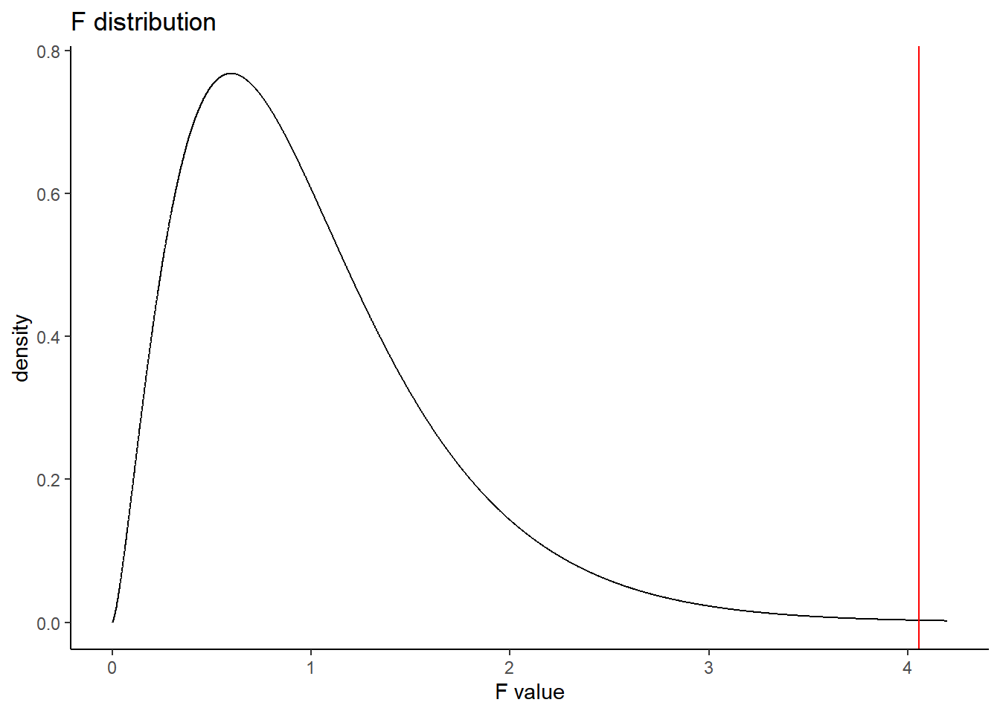
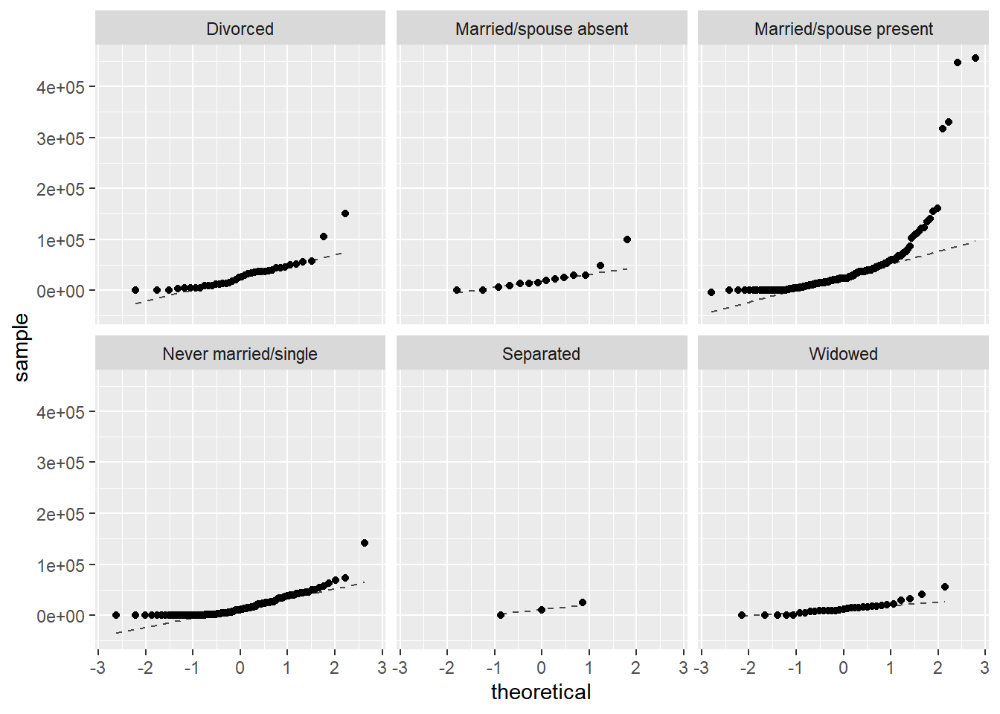
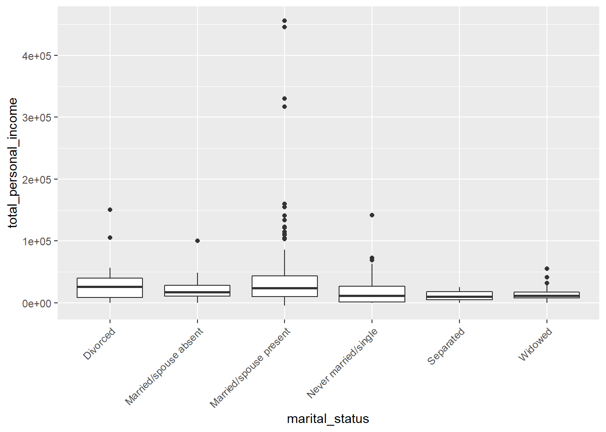
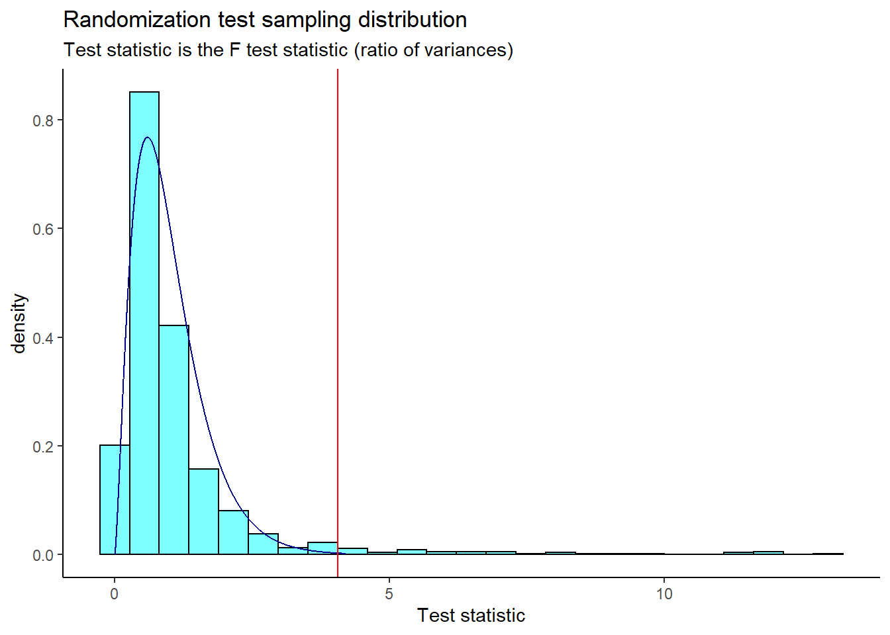
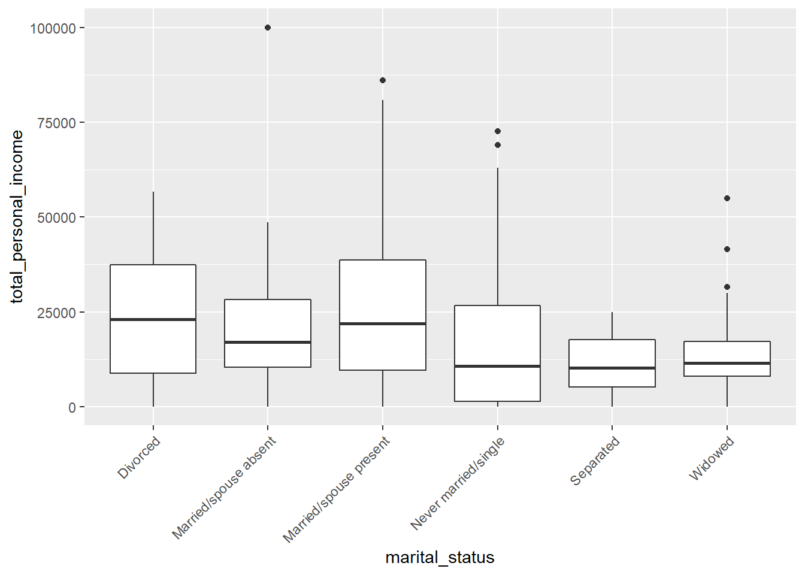

# Analysis of Variance {#ANOVA}

## Objectives

1) Conduct and interpret a hypothesis test for equality of two or more means using both permutation and the $F$ distribution.   

2) Know and check the assumptions for ANOVA.  


## Homework  

### Problem 1  

**Census data.** A group of researchers wants to conduct an Analysis of Variance to investigate whether there is a relationship between marital status and total personal income. They obtained a random sample of 500 observations from the 2000 U.S. Census. The data is available in the `census` data set in the **openintro** package. 


```r
head(census)
```

```
## # A tibble: 6 x 8
##   census_year state_fips_code total_family_income   age sex    race_general   
##         <int> <fct>                         <int> <int> <fct>  <fct>          
## 1        2000 Florida                       14550    44 Male   Two major races
## 2        2000 Florida                       22800    20 Female White          
## 3        2000 Florida                           0    20 Male   Black          
## 4        2000 Florida                       23000     6 Female White          
## 5        2000 Florida                       48000    55 Male   White          
## 6        2000 Florida                       74000    43 Female White          
## # ... with 2 more variables: marital_status <fct>, total_personal_income <int>
```

a. State the null and alternative hypotheses in context of the research problem. Note: there are six different marital status types.  

$H_0$: The average total personal income is equal for every marital status. $\mu_{\text{divorced}} = \mu_{\text{absent}} = \mu_{\text{present}} = \mu_{\text{single}} = \mu_{\text{separated}} = \mu_{\text{widowed}}$  

$H_A$: The average total personal income for at least one marital status is different. 

b. Using the `aov()` function, conduct an ANOVA using a significance level of $\alpha = 0.05$. Clearly state your conclusion. 


```r
summary(aov(total_personal_income ~ marital_status, data = census))
```

```
##                 Df    Sum Sq   Mean Sq F value  Pr(>F)   
## marital_status   5 4.145e+10 8.290e+09   4.055 0.00134 **
## Residuals      386 7.891e+11 2.044e+09                   
## ---
## Signif. codes:  0 '***' 0.001 '**' 0.01 '*' 0.05 '.' 0.1 ' ' 1
## 108 observations deleted due to missingness
```

The $p$-value is 0.00134. We reject the null hypothesis and conclude that the average total personal income for at least one marital status is different from the others. The plot below shows the $F$ distribution with the observed $F$ test statistic shown as a red line.  


```r
gf_dist("f", df1 = 5, df2 = 386) %>%
  gf_vline(xintercept = 4.055, color = "red") %>%
  gf_theme(theme_classic()) %>%
  gf_labs(title = "F distribution", x = "F value")
```




c. Is an ANOVA, using the $F$ distribution, appropriate for this data set?  Why or why not? Clearly communicate your answer, including appropriate data visualizations.  

It is reasonable to assume that the observations are independent within and between groups, as this is a random sample from the census. The other assumptions of ANOVA are not met though; the total personal income for each group is not normally distributed (seen in the faceted QQ plots) and the variance for each group does not appear to be equal (seen in the `favstats()` table and the boxplot). 


```r
census %>%
  gf_qq(~total_personal_income | marital_status) %>%
  gf_qqline()
```




```r
favstats(total_personal_income ~ marital_status, data = census)
```

```
##           marital_status   min    Q1 median      Q3    max     mean       sd
## 1               Divorced     0  8880  25650 39662.5 150500 29503.42 29552.24
## 2  Married/spouse absent     0 10375  17100 28255.0 100000 23652.86 25515.50
## 3 Married/spouse present -4400 10000  23850 43522.5 456000 38855.73 60230.72
## 4   Never married/single     0  1450  11160 26925.0 141900 17677.30 21152.51
## 5              Separated     0  5150  10300 17650.0  25000 11766.67 12564.37
## 6                Widowed     0  8050  11580 17150.0  55000 14095.29 12343.10
##     n missing
## 1  38       0
## 2  14       0
## 3 192       0
## 4 114     108
## 5   3       0
## 6  31       0
```


```r
census %>%
  gf_boxplot(total_personal_income ~ marital_status) %>%
  gf_theme(axis.text.x = element_text(angle = 45, hjust = 1))
```




d. Repeat part b), but use a randomization test this time. You should use $F$, the test statistic for ANOVA, as your test statistic.  

Load the **broom** library, which contains the `tidy()` function. 


```r
library(broom)
```

We can calculate the $F$ test statistic by taking $MS_G / MS_E$, or we can directly extract the value from the `aov()` output. We'll save this as our observed test statistic value. 


```r
obs <- aov(total_personal_income ~ marital_status, data = census) %>%
  tidy() %>%
  drop_na() %>%
  pull(statistic)
obs 
```

```
## [1] 4.055081
```

Under the null hypothesis, the `marital_status` doesn't matter. Thus, we use `shuffle()` to move around the `marital_status` labels. Now, let's define a function to get our $F$ test statistic under the null hypothesis.  


```r
f_stat <- function(x) {
  aov(total_personal_income ~ shuffle(marital_status), data = x) %>%
  tidy() %>%
  drop_na() %>%
  pull(statistic)
}
```

Let's check our function. 


```r
set.seed(1234)
f_stat(census)
```

```
## [1] 0.3830356
```

Let's run the randomization test.  


```r
set.seed(1234)
results <- do(1000)*f_stat(census)
```

Now we plot the sampling distribution from the randomization test. The $F$ distribution is overlaid as a dark blue curve, and the observed $F$ test statistic is shown as a red line. 


```r
results %>%
  gf_dhistogram(~f_stat, fill = "cyan", color = "black") %>%
  gf_dist("f", df1 = 5, df2 = 386, color = "darkblue") %>%
  gf_vline(xintercept = obs, color = "red") %>%
  gf_theme(theme_classic()) %>%
  gf_labs(title = "Randomization test sampling distribution",
          subtitle = "Test statistic is the F test statistic (ratio of variances)",
          x = "Test statistic")
```



Finally, we calculate the $p$-value. 


```r
prop1(~(f_stat >= obs), results)
```

```
##  prop_TRUE 
## 0.03496503
```

This $p$-value is much larger than that found with the ANOVA using the $F$ distribution. The $p$-value for the "traditional" ANOVA makes the assumptions of independent observations, normally distributed data within each group, and constant variance across groups. However, we know from part c) that the latter two assumptions are not met, and thus ANOVA using the $F$ distribution is not valid. Still, our permutation test leads us to the same conclusion; we reject the null hypothesis and conclude that not all groups are equal. That is, the average total personal income for at least one marital status is different. 


e. How do we determine which groups are different? 

One way is to perform all possible pairwise comparisons (e.g., divorced vs. absent, divorced vs. present, divorced vs. single, etc.). This strategy can be dangerous though. With six marital status types, we will have $\binom{6}{2} = 15$ comparisons. However, with this many comparisons, our Type 1 error is inflated and it is likely we'll find a difference just by chance. There are adjustments that can be made to the significance level to correct for many comparisons, such as the Tukey and Bonferroni method. These allow us to make many pairwise comparisons and keep the Type 1 error rate low.  


f. Below is a boxplot of the total personal income by marital status. We have "zoomed in" on the $y$-axis, considering only total personal income between \$0 and \$100,000, and rotated the text on the $x$-axis. The largest difference between sample means appears to be between the separated and married/spouse absent groups. Why can't we simply determine whether there is a statistically significant difference between $\mu_{\text{absent}}$ and $\mu_{\text{separated}}$? 


```r
census %>%
  gf_boxplot(total_personal_income ~ marital_status) %>%
  gf_lims(y = c(0, 100000)) %>%
  gf_theme(axis.text.x = element_text(angle = 45, hjust = 1))
```



This is *data fishing*. We are inspecting the data before picking groups to compare. We should test for a difference among all the groups, or choose groups to compare before looking at the data.


