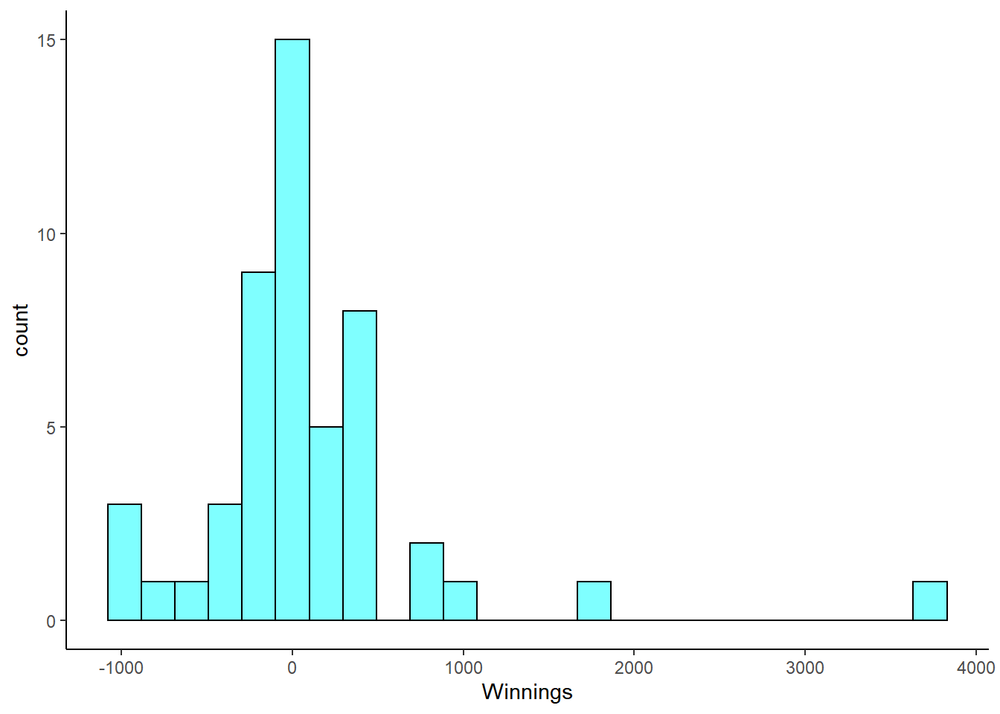
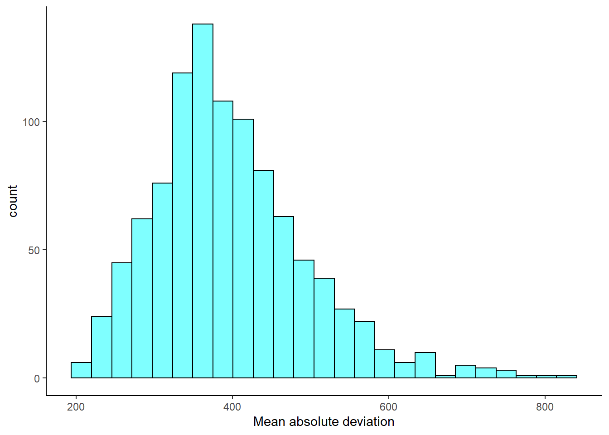
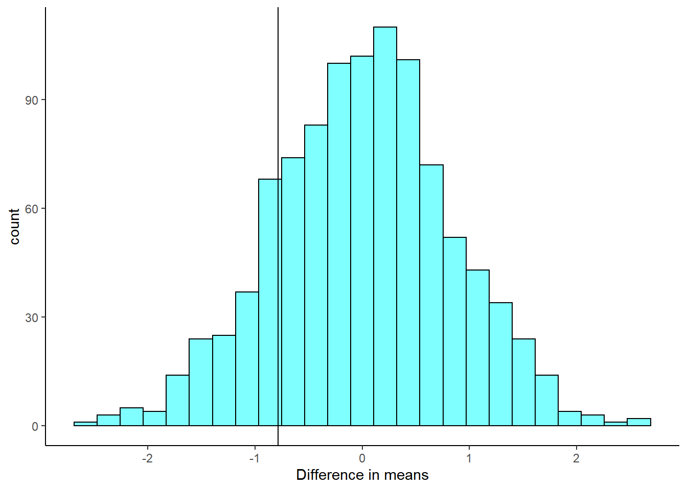
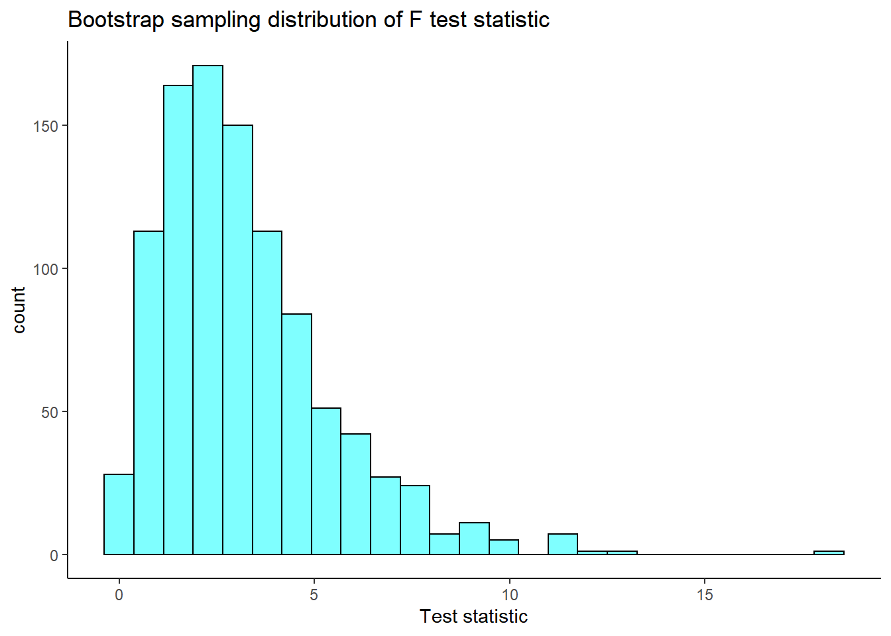

# Bootstrap {#BOOT}

## Objectives

1) Use the bootstrap to estimate the standard error of a sample statistic.  

2) Using bootstrap methods, obtain and interpret a confidence interval for an unknown parameter, based on a random sample.   

3) Describe the advantages, disadvantages, and assumptions behind bootstrapping for confidence intervals.  


## Homework  

### Problem 1

**Poker**. An aspiring poker player recorded her winnings and losses over 50 evenings of play, the data is in the `openintro` package in the object `poker`. The poker player would like to better understand the volatility in her long term play.

a. Load the data and plot a histogram.  


```r
poker<-read_csv("data/poker.csv")
```


```r
poker %>%
  gf_histogram(~winnings,fill="cyan",color="black") %>%
  gf_theme(theme_classic()) %>%
  gf_labs(x="Winnings")
```




b. Find the summary statistics.  


```r
favstats(~winnings,data=poker)
```

```
##    min   Q1 median  Q3  max  mean       sd  n missing
##  -1000 -187     11 289 3712 90.08 703.6835 50       0
```


c.  *Mean absolute deviation* or *MAD* is a more intuitive measure of spread than variance. It directly measures the average distance from the mean. It is found by the formula:
$$mad = \sum_{i=1}^{n}\frac{\left| x_{i} - \bar{x} \right|}{n}$$
Write a function and find the *MAD* of the data.


```r
mad<-function(x){
  xbar<-mean(x)
  sum(abs(x-xbar))/length(x)
}
```


```r
obs<-mad(poker$winnings)
obs
```

```
## [1] 394.1792
```


d. Find the bootstrap distribution of the *MAD* using 1000 replicates.


```r
set.seed(1122)
results<-do(1000)*mad(resample(poker$winnings))
```

e. Plot a histogram of the bootstrap distribution.


```r
results %>%
  gf_histogram(~mad,fill="cyan",color="black") %>%
  gf_theme(theme_classic()) %>%
  gf_labs(x="Mean absolute deviation")
```




f. Report a 95% confidence interval on the MAD.


```r
cdata(~mad,data=results)
```

```
##         lower    upper central.p
## 2.5% 243.9448 636.0925      0.95
```


g. ADVANCED: Do you think sample MAD is an unbiased estimator of population MAD? Why or why not? 

We don't know without doing some math. We do know that the sample standard deviation is biased and part of that is because we have to use the sample mean in its calculation. We are doing the same thing here, so our estimate might also be biased for the same reason.


### Problem 2

**Bootstrap hypothesis testing**  

Bootstrap hypothesis testing is relatively undeveloped, and is generally not as accurate as permutation testing. Therefore in general avoid it. But for our problem in the reading, it may work. We will sample in a way that is consistent with the null hypothesis, then calculate a $p$-value as a tail probability like we do in permutation tests. This example does not generalize well to other applications like relative risk, correlation, regression, or categorical data.

a. Using the `HELPrct` data set, store the observed value of the difference of means for male and female.  

I am going to just select the two columns I need.


```r
HELP_sub <- HELPrct %>%
  select(age,sex)
```


```r
obs <- diffmean(age~sex,data=HELP_sub)
obs
```

```
##   diffmean 
## -0.7841284
```


b. The null hypothesis requires the means of each group to be equal. Pick one group to adjust, either `male` or `female`. First, zero the mean of the selected group by subtracting the sample mean of this group from data points only in this group. Then, add the sample mean of the other group to each data point in the selected group. Store in a new object called `HELP_null`.

This is tricky, we are doing some data wrangling here.


```r
means<-mean(age~sex,data=HELP_sub)
means
```

```
##   female     male 
## 36.25234 35.46821
```


```r
means['female']
```

```
##   female 
## 36.25234
```

Let's get all the female observations and adjust the mean to equal that of the males.


```r
H_female <- HELP_sub %>%
  filter(sex=="female") %>%
  mutate(age=age-means['female']+means['male'])
```


```r
mean(~age,data=H_female)
```

```
## [1] 35.46821
```

Combine back into one data set.


```r
HELP_sub_new<-HELP_sub %>%
  filter(sex=="male") %>%
  rbind(H_female)
```


c. Run `favstats()` to check that the means are equal.


```r
favstats(age~sex,data=HELP_sub_new)
```

```
##      sex      min       Q1   median       Q3      max     mean       sd   n
## 1 female 20.21587 30.21587 34.21587 39.71587 57.21587 35.46821 7.584858 107
## 2   male 19.00000 30.00000 35.00000 40.00000 60.00000 35.46821 7.750110 346
##   missing
## 1       0
## 2       0
```

d. On this new adjusted data set, generate a bootstrap distribution of the difference in sample means.


```r
set.seed(1159)
results<-do(1000)*diffmean(age~sex,data=resample(HELP_sub_new))
```


e. Plot the bootstrap distribution and a line at the observed difference in sample means.


```r
results %>%
  gf_histogram(~diffmean,fill="cyan",color="black") %>%
  gf_vline(xintercept=obs) %>%
  gf_theme(theme_classic()) %>%
  gf_labs(x="Difference in means")
```

```
## Warning: geom_vline(): Ignoring `mapping` because `xintercept` was provided.
```




f. Find a $p$-value.


```r
2*prop1(~(diffmean<=obs),data=results)
```

```
## prop_TRUE 
## 0.3476523
```


g. How does the $p$-value compare with those in the reading?

This is a similar $p$-value.


### Problem 3

**Bootstrap for the $F$ statistic**. Repeat the analysis of the MLB data from the lesson but this time generate a bootstrap distribution of the $F$ statistic.

First, read in the data.


```r
mlb_obp <- read_csv("data/mlb_obp.csv")
```

Convert `position` to a factor.


```r
mlb_obp <- mlb_obp %>%
  mutate(position=as.factor(position))
```

Summarize the data.


```r
favstats(obp~position,data=mlb_obp)
```

```
##   position   min      Q1 median      Q3   max      mean         sd   n missing
## 1        C 0.219 0.30000 0.3180 0.35700 0.405 0.3226154 0.04513175  39       0
## 2       DH 0.287 0.31625 0.3525 0.36950 0.412 0.3477857 0.03603669  14       0
## 3       IF 0.174 0.30800 0.3270 0.35275 0.437 0.3315260 0.03709504 154       0
## 4       OF 0.265 0.31475 0.3345 0.35300 0.411 0.3342500 0.02944394 120       0
```

We need a function to resample the data, we will use the `resample()` from the `mosaic` package.


```r
library(broom)
```


```r
f_boot <- function(x){
  aov(obp~position,data=resample(x)) %>%
  tidy() %>%
  summarize(stat=meansq[1]/meansq[2]) %>%
  pull()
}
```


```r
set.seed(541)
results<-do(1000)*f_boot(mlb_obp)
```

Let's plot our sampling distribution.


```r
results %>%
  gf_histogram(~f_boot,fill="cyan",color="black") %>%
  gf_theme(theme_classic()) %>%
  gf_labs(title="Bootstrap sampling distribution of F test statistic",
          x="Test statistic")
```



Now the confidence interval for the F-statistic is:


```r
cdata(~f_boot,data=results)
```

```
##          lower    upper central.p
## 2.5% 0.3546682 8.724895      0.95
```

We are 95\% confident that the $F$ statistic is in the interval $(0.35,8.72)$ which includes 1 so we fail to reject the null hypothesis of equal means. Remember under the null hypothesis the ratio of the variance between means to the pooled variance within categories should be 1. 


